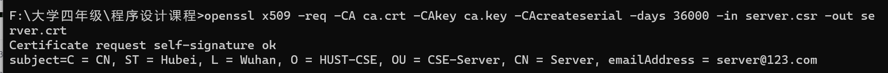

# 简单（丑陋）实现基于`OpenSSL`的安全聊天系统

* 点对点
* 基于`openssl`的安全套接字通信
* 客户端服务器双向验证
* 聊天记录本地加密，输入正确口令查看

* `openssl`需要安装`pyOpenSSL`

``pip install pyOpenSSl``

* `DES-CBC`加密 需要安装`pycryptodome`

``pip install pycrytodome``

* `CA、client、server`的证书生成过程

`CA`私钥生成（注意将所有私钥生成`1024`位改成`2048`位）

`CA`请求文件生成

`CA`证书生成

`server`私钥生成

`server`请求文件生成

`server`证书生成

`client`私钥生成

`client`请求文件生成

`client`证书生成

* 先运行`tcpserver.py`，再运行`tcpclient.py`就可以进行通信
* 任意一方输入`exit`结束通信
* `client`输入`read`读取本地聊天
* ~~程序鲁棒性~~(**课设要啥鲁棒性`bushi`**)
* ~~聊天记录可读性~~（**课设要啥可读`bushi`**）

